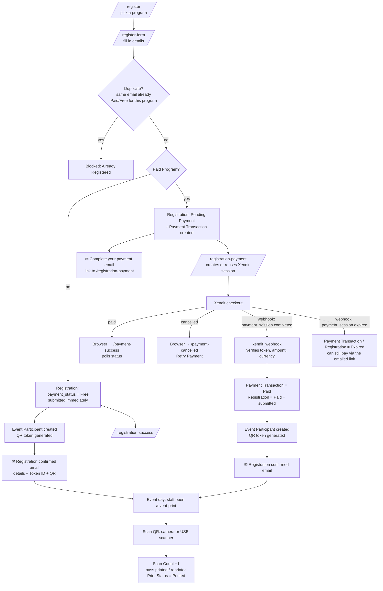

## Registration Portal

A Frappe app for public event registration. It supports paid events (collected through
[Xendit](https://www.xendit.co/) Payment Sessions) and free events. Every confirmed
registrant gets an email with a QR code, which staff scan on the event day to print a pass.

---

## Variables used in this guide

Set these once in your terminal. The commands and URLs below use them, so you can paste
them as they are.

```bash
export SITE=xendit.localhost                 # your bench site name
export DOMAIN=abcd-1234.ngrok-free.app       # public domain only: no https://, no trailing /
```

| Variable | Meaning | Example (local, ngrok) | Example (production) |
| --- | --- | --- | --- |
| `${SITE}` | The bench site the app is installed on | `xendit.localhost` | `events.example.com` |
| `${DOMAIN}` | The public domain people and Xendit reach the site at | `abcd-1234.ngrok-free.app` | `events.example.com` |

Wherever you see `${DOMAIN}` in a URL, replace it with your real domain. For example,
`https://${DOMAIN}/payment-success` becomes `https://events.example.com/payment-success`.

---

## 1. Requirements

| App | Why it's needed | Source |
| --- | --- | --- |
| **Frappe** (v15) | The framework | Installed by `bench init` |
| **Scan Me** | Generates the QR codes for the pass print format, the Event Participant form and the confirmation email | https://github.com/Tusharp21/scan_me |
| **Registration Portal** | This app | This repository |

You also need:

- A **Xendit account** (test mode is fine for development).
- A **public HTTPS URL** for the site, so Xendit can send webhooks and redirect customers back.
  For local development, use [ngrok](https://ngrok.com/) or something similar.
- An **outgoing Email Account** in Frappe, so registrants receive their emails.

> Scan Me must be installed **before** Registration Portal. The pass print format and the
> email code call `scan_me.utils.jinja_functions.qr`.

---

## 2. Installation

```bash
cd $PATH_TO_YOUR_BENCH

# 1. Scan Me
bench get-app https://github.com/Tusharp21/scan_me.git --branch develop
bench --site ${SITE} install-app scan_me

# 2. Registration Portal
bench get-app $URL_OF_THIS_REPO --branch develop
bench --site ${SITE} install-app registration_portal

bench --site ${SITE} migrate
```

### Local development with ngrok

```bash
bench start                      # site runs on e.g. http://localhost:8002
ngrok http 8002                  # gives you e.g. https://abcd-1234.ngrok-free.app
export DOMAIN=abcd-1234.ngrok-free.app
```

Tell Frappe its public address so links in emails point to it instead of `localhost`:

```bash
bench --site ${SITE} set-config host_name "https://${DOMAIN}"
```

> **Free ngrok URLs change every time ngrok restarts.** When that happens, update
> `host_name`, the Success/Cancel URLs in **Xendit Settings**, and the webhook URLs in the
> **Xendit dashboard** (see below).

---

## 3. Configuration

### 3.1 Outgoing email

**Email Account** → New → enter your SMTP details → tick **Enable Outgoing** and
**Default Outgoing**. For Gmail or Google Workspace, use an app password.

If no outgoing account exists, registrations still go through. The emails fail and are
logged in **Error Log** as `Registration Email Failed - <name>`.

### 3.2 Xendit Settings (in Frappe)

Open **Xendit Settings** (a single DocType):

| Field | Value | Where to get it |
| --- | --- | --- |
| **Enabled** | ✔ | – |
| **Test Mode** | For your own reference only. The code doesn't read it. Xendit decides test or live from the API key you use. | – |
| **Secret API Key** | `xnd_development_...` (test) or `xnd_production_...` (live) | Xendit Dashboard → **Settings → API Keys** → Generate secret key. Give it **write** permission for money-in / payments. Do **not** use the *public* key (`xnd_public_...`); the app rejects it. |
| **Webhook Verification Token** | Long random string | Xendit Dashboard → **Settings → Webhooks** → *Webhook verification token* |
| **Success URL** | `https://${DOMAIN}/payment-success` | Where the customer's **browser** goes after paying |
| **Cancel URL** | `https://${DOMAIN}/payment-cancelled` | Where the customer's **browser** goes if they cancel |

To check the API key, call `registration_portal.registration_portal.api.test_xendit_connection`
as a System Manager (for example from the browser console with `frappe.call`). A
`status_code` of `200`/`201` means the key works.

### 3.3 Webhooks (in the Xendit dashboard)

Xendit Dashboard → **Settings → Webhooks** (in the same mode, Test or Live, as your API key).
Set **both** Payment Session events to this **API endpoint**:

```
https://${DOMAIN}/api/method/registration_portal.registration_portal.api.xendit_webhook
```

For example, with `DOMAIN=events.example.com`:

```
https://events.example.com/api/method/registration_portal.registration_portal.api.xendit_webhook
```

To print your exact URL:

```bash
echo "https://${DOMAIN}/api/method/registration_portal.registration_portal.api.xendit_webhook"
```

| Xendit event | URL |
| --- | --- |
| Payment session **completed** | the URL above |
| Payment session **expired** | the URL above |

> ⚠️ **Don't confuse webhook URLs with return URLs.**
> Webhooks are called by **Xendit's server** in the background and must point to the
> `/api/method/...xendit_webhook` endpoint. If you put `/payment-success` there, Xendit's
> notifications land on a web page that ignores them, and payments stay **Pending forever**.
> `/payment-success` and `/payment-cancelled` belong in **Xendit Settings** in Frappe only.

Click **Test** next to the webhook in Xendit to check it:

- **200** means it's reachable and the token matches. A test event uses a fake session, so
  Frappe logs `Xendit Payment Transaction Not Found`. That's expected.
- **401** means the Webhook Verification Token in Frappe doesn't match Xendit's.

Every webhook received is logged in **Error Log** as `Xendit Webhook - <event>`, which helps
with debugging.

### 3.4 Create a Registration Program

**Registration Program** → New:

- **Program Name**: shown to registrants and used as the ID.
- **Paid Program**: ticked means registrants pay through Xendit. Unticked means a free
  program, confirmed immediately.
- **Registration Fee / Currency**: required for paid programs only.
- **Registration Start / End**: the window during which the program is listed.
- **Maximum Registrants**: optional cap.
- **Enabled**: must be ticked for the program to appear on `/register`. It stays editable
  after publishing, so untick it to close registration.
- **Additional Questions** (optional): extra questions for this program only, such as
  Company, T-shirt Size or Handicap. Each one has a type (text, number, date, dropdown,
  checkbox, phone, email), whether it's **Required**, and whether it's included in the
  confirmation email. Name, email and mobile number are always asked; you don't add them here.

Then **Submit** the program. **Submitting publishes it.** Draft programs don't appear on
`/register` and can't be registered for. After publishing, the fee, paid/free setting and
questions are locked so every registrant answers the same form. The dates, capacity,
description and **Enabled** can still be changed.

---

## 4. Workflow



### Step by step

1. **Choose a program.** The registrant opens `/register` and picks an open program.
2. **Register.** They fill in `/register-form?program=...`: the standard fields plus any extra
   questions defined on the program.
   - An email can register **once per program**. A second registration is blocked only if
     the first one is **Paid** or **Free**. Unpaid attempts don't block, so someone who
     abandoned checkout can try again.
3. **Free program.** The registration is marked `Free` and submitted, the Event Participant
   (with QR token) is created, the confirmation email is sent, and the browser shows
   `/registration-success`.
4. **Paid program.**
   1. A **Payment Transaction** (`Pending`) is created and the **"Complete your payment"**
      email is sent straight away, in case the registrant leaves checkout.
   2. The browser goes to `/registration-payment`, which creates a Xendit Payment Session
      (or reuses an unexpired one) and redirects to Xendit checkout.
   3. After payment, **Xendit calls the webhook**. The app checks the callback token,
      amount and currency, marks the transaction and registration **Paid**, submits the
      registration, creates the **Event Participant**, and sends the **confirmation email**.
   4. Meanwhile the browser lands on `/payment-success`, which polls until the status turns
      Paid. **The status only changes when the webhook arrives.** The return URL alone
      doesn't mark anything as paid.
5. **Event day.** Staff (logged in) open `/event-print` and scan the attendee's QR.
   Scanning is **unlimited**: every scan is counted (`Scan Count`, `Last Scanned At/By`)
   and prints the pass, including reprints. Revoked QR codes and unpaid registrations are
   rejected.

---

## 5. Important DocTypes

| DocType | Module | Purpose |
| --- | --- | --- |
| **Registration Program** | Registration Portal | An event or program people register for. Controls paid/free (`is_paid`), fee, currency, registration window, capacity, visibility (`enabled`) and extra questions. **Submit = publish**: only submitted programs are shown. |
| **Registration Program Field** | Registration Portal | Child table on Registration Program: one extra question (label, type, options, required, show in email). |
| **Registration** | Registration Portal | One person's registration for a program. Holds personal details, `amount`, `payment_status` (`Pending Payment`, `Paid`, `Free`, `Expired`, …) and a secret `payment_token` used in public URLs. **Submitted** once Paid or Free. Enforces one confirmed registration per email per program. |
| **Registration Answer** | Registration Portal | Child table on Registration: the registrant's answers to the program's extra questions. Validated on the server. |
| **Payment Transaction** | Registration Portal | One Xendit payment attempt for a Registration (paid programs only). Stores the Xendit session ID, `payment_url`, expiry, `status` and Xendit payment ID. |
| **Event Participant** | Registration Portal | Created automatically once a Registration is Paid or Free. Holds the unique **`qr_token`** (encoded in the QR), QR status (`Active`/`Used`/`Revoked`), **Scan Count**, last scan info and print status. The form shows the QR image. Setting **QR Status = Revoked** blocks the code at the scanner. |
| **Xendit Settings** | Xendit Registration | Single DocType with the API key, webhook token and browser return URLs. |
| **Event Participant Print Format** | – | Print format for the event pass. Renders the QR with Scan Me's `qr_img`. |

Other places to look:

- **Email Queue**: outgoing registration emails and their send status.
- **Error Log**: `Xendit Webhook - …` (every webhook received), `Xendit Payment Session Error`,
  and `Registration Email Failed - …`.

---

## 6. Web Pages

| Route | Who uses it | Purpose |
| --- | --- | --- |
| `/register` | Public | Lists open Registration Programs with their fee ("Free" for free programs). |
| `/register-form?program=<name>` | Public | Web Form that creates a Registration. Redirects to payment (paid) or success (free). |
| `/registration-payment?token=<payment_token>` | Public | Creates or reuses the Xendit Payment Session and redirects to Xendit checkout. Also the link in the "Complete your payment" email. |
| `/payment-success?token=…` | Public (Xendit return URL) | Polls the registration until the webhook marks it Paid, then shows the confirmation. |
| `/payment-cancelled?token=…` | Public (Xendit return URL) | Shown when checkout is cancelled. Offers **Retry Payment**. |
| `/registration-success?token=…` | Public | Confirmation page for **free** programs. |
| `/event-print` | **Logged-in staff** | Event-day station. Scans a QR with the camera or a USB scanner, counts the scan and prints the participant's pass. |

### API endpoints (`registration_portal.registration_portal.api.*`)

| Method | Guest? | Purpose |
| --- | --- | --- |
| `get_registration_programs` | ✔ | Open programs for `/register` |
| `get_program_details` | ✔ | One program's details for the form |
| `start_registration_payment` | ✔ | Create or reuse a Xendit session (by `payment_token`) |
| `get_registration_payment_status` | ✔ | Status polling for the result pages |
| `xendit_webhook` | ✔ (token-verified) | **The URL to give Xendit** |
| `create_payment_session` | System Manager | Manually create a session for a Payment Transaction |
| `test_xendit_connection` | System Manager | Check the Xendit API key |

Scanning and printing endpoints are in `registration_portal.registration_portal.event_printing`
(`scan_event_participant`, `mark_event_participant_printed`, …) and require login.

---

## 7. Troubleshooting

| Symptom | Cause / fix |
| --- | --- |
| Paid on Xendit but status stays **Pending** | The webhook isn't reaching the site. Check the Xendit webhook URL points to `/api/method/registration_portal.registration_portal.api.xendit_webhook` (not `/payment-success`) and that the ngrok URL is current. Then **Resend** the webhook from the Xendit dashboard. |
| Webhook returns **401** | The Webhook Verification Token in Xendit Settings doesn't match the Xendit dashboard. |
| "Unable to create Xendit payment session" | Check **Error Log → Xendit Payment Session Error** for Xendit's response, usually a wrong or public API key or missing key permissions. |
| No emails arrive | No default outgoing Email Account, or the scheduler is off (`bench --site ${SITE} enable-scheduler`). Check **Email Queue** and **Error Log**. |
| Links in emails point to `localhost` | Set `host_name` in site config (see §2). |
| "… is already registered for …" | Expected: that email already has a Paid/Free registration for the program. |

---

## Contributing

This app uses `pre-commit` for code formatting and linting. Please [install pre-commit](https://pre-commit.com/#installation) and enable it for this repository:

```bash
cd apps/registration_portal
pre-commit install
```

Pre-commit is configured to use the following tools for checking and formatting your code:

- ruff
- eslint
- prettier
- pyupgrade

## License

mit
